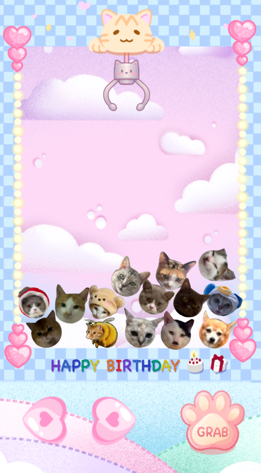

# 🎡 Claw_Machine

เกมตู้คีบของรางวัลแบบ 2D พัฒนาโดยใช้ **Construct 3** แบบ **free plan** สร้างใน 24 ชม.
// ระบบฟิสิกส์ง่าย ๆ, คีบสำเร็จทุกครั้ง และ Popup แสดงรางวัล 🎀
// English Below
---

## 🕹️ Features

- 🐾 **ควบคุมแบบทัชสกรีน** (Touch control)  
- 🎁 **คีบของสำเร็จเสมอ** – สร้างของแบบสุ่มที่ตำแหน่งขาที่คีบ  
- ⚙️ **Physics ของรางวัล** เด้งๆๆๆๆ  
- 📦 **Random reward system** เลือกรางวัลจากหลายแบบ
- 🎉 **Popup** แสดงภาพของรางวัลที่คีบได้  
- 📱 **รองรับการเล่นบนมือถือ**  

## 📦 Tech Stack

- **Engine:** Construct 3  
- **Type:** HTML5 Web Game  
- **Export:** Web (HTML5 Website)  
- **Deploy:** GitHub Pages  

---

## 🚀 How to Play

1. กดปุ่มลูกศร (หรือปุ่มทัชบน UI) เพื่อเลื่อนกรงเล็บซ้าย-ขวา  
2. กดปุ่ม “Grab” เพื่อให้กรงเล็บลดระดับลง  
3. ระบบจะสร้างของรางวัลแบบสุ่มที่ตำแหน่งขาที่คีบให้โดยอัตโนมัติ  
4. กรงเล็บยกขึ้นพร้อมรางวัล 🎁  
5. Popup แสดงรางวัลที่ได้รับ  
6. กด “เล่นอีกครั้ง” เพื่อเริ่มใหม่

---

## 📲 Deploy on GitHub Pages

1. Export เกมจาก Construct 3 แบบ **HTML5 Website**  
2. สร้าง GitHub Repository  
3. อัพโหลดไฟล์ทั้งหมด
4. ไปที่ **Settings → Pages**  
5. เลือก  
    Source: Deploy from branch
    Branch: main / root
6. เปิดลิงก์ที่ GitHub Pages ให้มา

---

## 🧸 Rewards (Examples)

- 🐱 แมว

(เพิ่ม/แก้ไขรางวัลเองใน Construct 3)

---

## 🖼️ Screenshots

---

## ❤️ Credits

- Developed by: **JaoNangJN**  
- Engine: **Construct 3**  
- Assets: Custom sprites + free game assets  
- Special thanks: ChatGPT assistant 😊

---

## 📜 License

โครงการนี้ตั้งใจเพื่อการเรียนรู้และพัฒนาเกมเว็บเบื้องต้น  
ห้ามนำไปใช้เพื่อการค้าโดยไม่ได้รับอนุญาต

--------------------------------------------------------------------

# 🎡 Claw Machine Web Game

A cute 2D claw machine game built with **Construct 3** with **free plan** in 24 Hr.
// featuring simple physics, touch controls, guaranteed grabs, and a prize popup system. 🎀

---

## 🕹️ Features

- 📱 **Touch-based claw controls** for mobile  
- 🎁 **Guaranteed prize grab** — no failed attempts. Generate random items at the clamped leg position.
- ⚙️ **Lightweight physics** for balls (bounce & roll)  
- 🎉 **Custom popup screen** showing the item you won.  
- 🌐 **HTML5 export** — deployable on GitHub Pages  
- 🧩 Easy to modify and extend

---

## 📦 Tech Stack

- **Engine:** Construct 3  
- **Type:** HTML5 Web Game  
- **Deployment:** GitHub Pages  
- **Supported devices:** Mobile & Desktop browsers  

---

## 🚀 How to Play

1. Swipe/press the arrow buttons to move the claw left or right.  
2. Tap the **Grab** button to lower the claw.  
3. The system will automatically generate a random prize at the pinched leg position.
4. The claw lifts the prize up.  
5. A **Congratulations Popup** appears with the prize you won.  
6. Tap **Play Again** to start a new round.

---

## 📲 Deploying on GitHub Pages

1. Export your project as **HTML5 Website** from Construct 3.  
2. Create a new GitHub repository.  
3. Upload all exported files.
4. Go to **Settings → Pages**  
5. Set:
    Source: Deploy from branch
    Branch: main / root
6. Open the GitHub Pages link provided.

---

## 🧸 Example Prizes

- 🐱 Only Cat (Some are mine some from cat meme.)
These can be customized in Construct 3.

---

## 🖼️ Screenshots

---

## ❤️ Credits

- **Developer:** JaoNangJN 
- **Engine:** Construct 3  
- **Assets:** Custom-made + free resources  
- **Assistant:** ChatGPT 🤖

---

## 📜 License

This project is intended for learning and personal development.  
Not for commercial use without permission.
